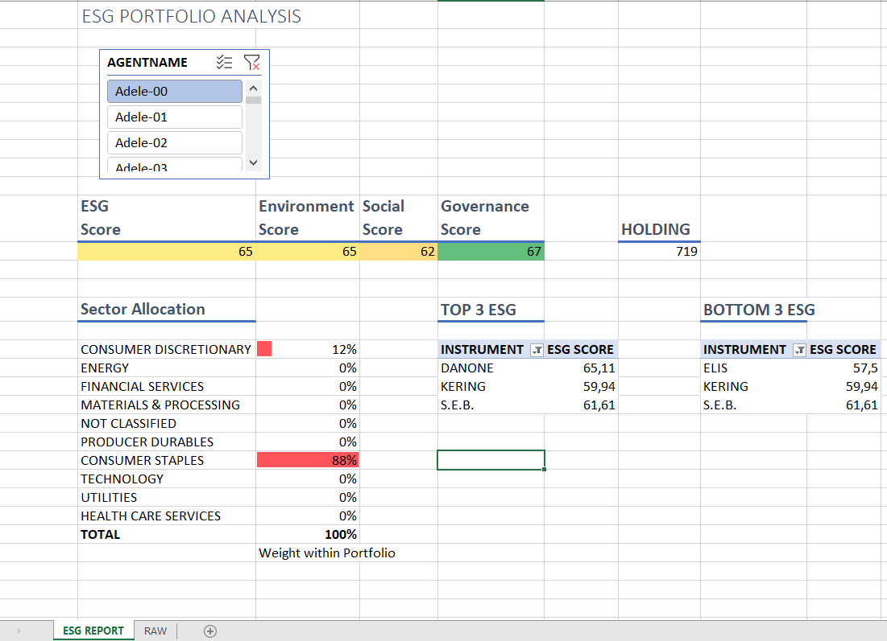
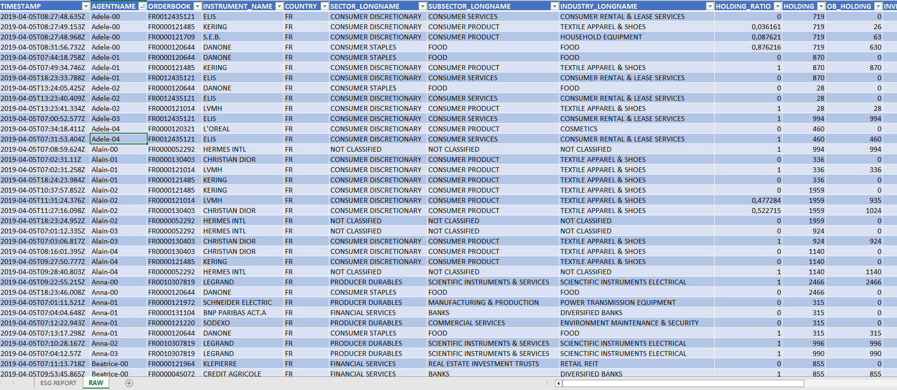

# FINAXYS DATA DAY #2

## Introduction

In this workshop, you are working in a Financial reporting team in a well known Asset Manager.

You are requested to produce ESG performance tracking spreadsheets integrating all the funds of your Asset Manager.

Those spreadsheets leverage data from your Asset Manager _infocentre_.

This task is error-prone, time-consuming and with very little added value.

Thus, you want to industrialize the process and give your clients direct access to your data.

## Activity 1 - Excel ESG reporting

You are given an example of  an ESG reporting with Excel

### Reporting worksheet

### Raw data worksheet

## Activity 2 - Streamlit presentation

## Activity 3 - Streamlit hands-on

### Installation

1. Connect to Gitpod with a Finaxys Account [Link to GitPod](https://gitpod.io/#https://github.com/Finaxys/data-day-2)
2. Install streamlit : `pip install streamlit`
3. Run streamlit example : `streamlit run src/esg_view.py`
4. Accept the dialog box and 'Open in browser'

### Challenge 1 : Complete the streamlit application with TODO information

Complete the streamlit application with information given inside the code

### Challenge 2 : Data Science with jupyter Notebook

1. Install jupyter notebook : `pip install notebook`
2. Run jupyter with the configuration file : `jupyter notebook --NotebookApp.allow_remote_access=True --ip='*' --NotebookApp.token='' --NotebookApp.password=''`

### Challenge 3 : Run the same application with streamlit

1. Run streamlit example : `streamlit run src/prices_view.py`
2. Accept the dialog box and 'Open in browser'